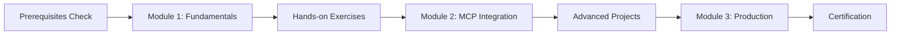

# ? Docker Workshop Portal

[](https://github.com/collabnix/docker-workshop-portal/actions)
[](https://opensource.org/licenses/MIT)
[](http://makeapullrequest.com)

> **Interactive, modern Docker workshop platform with Model Context Protocol (MCP) integration**

A comprehensive, hands-on learning experience for Docker containerization, featuring the latest innovations including Docker's MCP Toolkit integration with Gordon AI.

## ? Live Demo

**? [https://collabnix.github.io/docker-workshop-portal](https://collabnix.github.io/docker-workshop-portal)**


## ? Features

### ? **Interactive Learning**
- **Progressive Learning Path**: From Docker basics to advanced MCP integration
- **Hands-on Exercises**: Real terminal environments and code editors
- **Progress Tracking**: Visual progress indicators and completion badges
- **Multi-version Support**: Version-specific content (v1.0, v2.0, v3.0+)

### ? **MCP Integration Focus**
- **Docker MCP Toolkit**: Comprehensive coverage of Docker's MCP implementation
- **Gordon AI Integration**: Hands-on experience with Docker's AI assistant
- **MCP Server Development**: Build and deploy custom MCP servers
- **Real-world Scenarios**: Practical MCP use cases and implementations

### ? **Modern UI/UX**
- **Responsive Design**: Works perfectly on desktop, tablet, and mobile
- **Glassmorphism Design**: Modern, beautiful interface with smooth animations
- **Interactive Components**: Copy-paste code blocks, live terminals
- **Dark Theme Support**: Comfortable learning in any lighting

## ???? Quick Start

### Option 1: GitHub Pages (Instant Access)
Visit **[https://collabnix.github.io/docker-workshop-portal](https://collabnix.github.io/docker-workshop-portal)** to start learning immediately!

### Option 2: Local Development
```bash
# Clone the repository
git clone https://github.com/collabnix/docker-workshop-portal.git
cd docker-workshop-portal

# Start development server
npm install
npm start

# Open http://localhost:8000
```

### Option 3: Docker (Production-Ready)
```bash
# Run the containerized workshop
docker run -d -p 8000:80 ajeetraina/docker-workshop-portal:latest

# Or use docker-compose for full development environment
docker-compose up workshop-portal
```

## ? Workshop Modules

| Module | Focus | Status | Duration |
|--------|-------|--------|----------|
| **v1.0** | Docker Fundamentals | ? Available | 3-4 hours |
| **v2.0** | MCP Integration | ? Available | 2-3 hours |
| **v3.0** | Advanced Topics | ? Coming Soon | 4-5 hours |

### ? **Module 1: Docker Fundamentals (v1.0)**
- Container concepts and architecture
- Docker installation and setup
- Working with images and containers
- Writing effective Dockerfiles
- Container networking basics
- Volume management

### ? **Module 2: MCP Integration (v2.0)**
- Introduction to Model Context Protocol
- Docker MCP Toolkit overview
- Setting up Gordon AI
- Building MCP servers with Docker
- Container-based AI workflows
- Security and best practices

## ? Development Setup

### Prerequisites
- Node.js 18+ 
- Docker 24.0+
- Git

### Local Development
```bash
# Install dependencies
npm install

# Start development server (auto-reload enabled)
npm start

# Run tests
npm test

# Build for production
npm run build
```

### Docker Development
```bash
# Development environment with hot reload
docker-compose up workshop-portal

# Production testing
docker-compose --profile production up

# Full stack with database and monitoring
docker-compose --profile database --profile monitoring up
```

## ? Learning Path



## ? Contributing

We welcome contributions from the Docker community! 

### Ways to Contribute
- ? **Report Bugs**: [Create an issue](https://github.com/collabnix/docker-workshop-portal/issues)
- ? **Suggest Features**: [Start a discussion](https://github.com/collabnix/docker-workshop-portal/discussions)
- ? **Improve Content**: Submit PRs for exercises and documentation
- ? **Translations**: Help make the workshop accessible globally

### Development Process
```bash
# Fork and clone
git clone https://github.com/YOUR_USERNAME/docker-workshop-portal.git
cd docker-workshop-portal

# Create feature branch
git checkout -b feature/amazing-feature

# Make changes and test
npm start  # Test locally
npm test   # Run test suite

# Commit and push
git commit -m "Add amazing feature"
git push origin feature/amazing-feature

# Create Pull Request
```

## ? Deployment Options

| Platform | Setup | Best For |
|----------|-------|----------|
| **GitHub Pages** | Auto-deploy on push | Free hosting, perfect for most users |
| **Docker Hub** | Multi-arch containers | Production deployments |
| **Vercel/Netlify** | One-click deploy | Custom domains, edge hosting |
| **Self-hosted** | Full control | Enterprise, custom requirements |

## ? Analytics & Tracking

The workshop includes built-in analytics to help improve the learning experience:
- Module completion rates
- Exercise success metrics
- User engagement patterns
- Performance monitoring

*No personal data is collected without explicit consent.*

## ? Recognition & Certification

- **Completion Badges**: Earn badges for each module
- **Digital Certificates**: Downloadable completion certificates
- **Community Recognition**: Showcase your Docker skills
- **LinkedIn Integration**: Add certifications to your profile

## ? License

This project is licensed under the MIT License - see the [LICENSE](LICENSE) file for details.

## ? Acknowledgments

- **Docker Community**: For continuous innovation and support
- **Anthropic**: For the Model Context Protocol specification
- **Contributors**: Everyone who helps improve this workshop
- **Docker Inc**: For MCP Toolkit and Gordon AI development

## ? Support & Community

### ? Links
- **Website**: [collabnix.com](https://collabnix.com)
- **Slack Community**: [Join 6000+ DevOps members](https://collabnix.slack.com)
- **YouTube**: [Docker Tutorial Series](https://youtube.com/dockerlabs)
- **Blog**: [Docker & Kubernetes Articles](https://collabnix.com/tags/docker/)

### ??? Maintainer
**Ajeet Singh Raina**
- ? Docker Captain & ARM Innovator
- ? Senior Developer Advocate @ Docker Inc
- ? Community Leader, Docker Bangalore (12,500+ members)
- ? "Tip of Captain's Hat" Award Winner, DockerCon 2019

### ? Community Stats
- **Workshop Users**: 5,000+ developers trained
- **Community Size**: 12,500+ members in Docker Bangalore
- **Global Reach**: Available in multiple languages
- **Corporate Training**: Used by 50+ companies

---

<div align="center">

**? Star this repository if it helped you learn Docker! ?**

[? Report Bug](https://github.com/collabnix/docker-workshop-portal/issues) ? [? Request Feature](https://github.com/collabnix/docker-workshop-portal/issues) ? [? Join Community](https://collabnix.slack.com) ? [? Start Learning](https://collabnix.github.io/docker-workshop-portal)

</div>